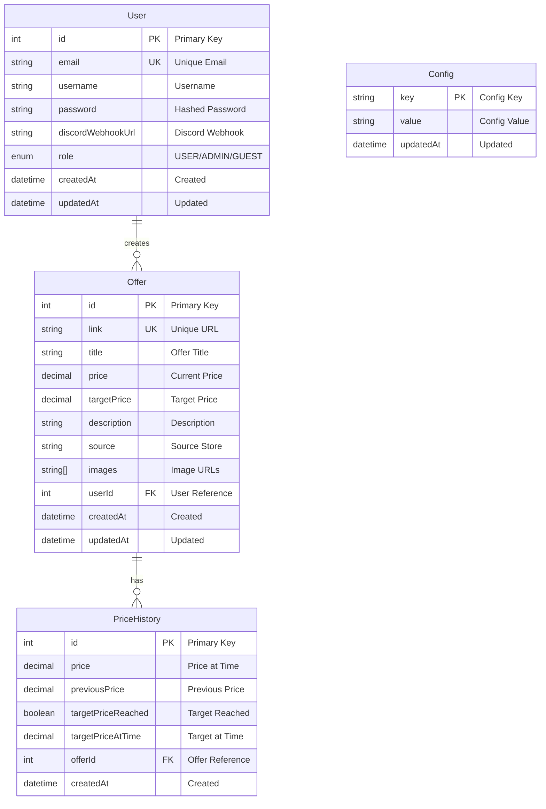

<pre>
      __                                                       
     /  \      ____  ____  _  _  ____  _  _  _  _  _  _  _  _  
    / /\ \    / ___]| ===|| \| ||  _  || |/ \| || \| || || / / 
   / /__\ \  | [___ | ___||  ` || |_| || \   / ||  ` || ||  \  
  /________\  \____]|____||_|\_||_____| \_/ \_/ |_|\_||_||_|\_\
  \        /                                                   
   \      /      -- P R I C E   T R A C K I N G   B O T --     
    \____/                                                     
</pre>

## Tech Stack

    

    

 

## About the Project

**Cenownik** is a backend application that automatically scrapes product prices from online stores. The user adds an offer link and sets a target price – when the price drops below the set value, they receive a notification.

### How It Works

1. User adds an offer link and sets the desired target price
2. Application periodically scrapes the page and checks the current price
3. When the price drops below the set value, the user receives a notification

### Target Audience

Users looking for the best deals on products from online stores.

### Added Value

- **Time saved** - automatic price monitoring instead of manual checking
- **Better deals** - instant notifications when prices drop
- **Multi-store support** - aggregation from multiple sources
- **Price history** - track price changes over time

### API Documentation

Swagger documentation available at: `http://localhost:3000/api`

## Features

- **Database storage** - persist offer links and target prices
- **Price scraping** - automatically fetch prices from online stores
- **User authentication** - JWT-based login and registration
- **Email notifications** - alerts when prices drop below target
- **Discord notifications** - receive alerts via Discord webhooks
- **Price history** - track price changes over time
- **Scheduled scraping** - configurable cron-based price checking

## Supported Stores

- **morele.net** - scraped via Cheerio (static HTML)
- **x-kom.pl** - scraped via Playwright (JavaScript-rendered)

## Database Schema

## License

MIT
